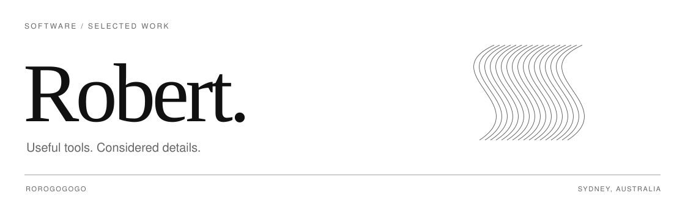

<picture>
  <source media="(prefers-color-scheme: dark) and (max-width: 600px)" srcset="./assets/cover-dark-compact.svg" />
  <source media="(max-width: 600px)" srcset="./assets/cover-light-compact.svg" />
  <source media="(prefers-color-scheme: dark)" srcset="./assets/cover-dark.svg" />
  
</picture>

I build software that makes work a little simpler—from AI developer tools to small native apps. Currently building **[NoMoreIDE](https://github.com/Rorogogogo/nomoreide)**.

[Portfolio ↗](https://robert.jobjourney.me/) &nbsp; / &nbsp; [Explore NoMoreIDE ↗](https://nomoreide.com) &nbsp; / &nbsp; [JobJourney ↗](https://jobjourney.me)

 

### Selected projects

| Project | Purpose |
| :--- | :--- |
| **[NoMoreIDE](https://github.com/Rorogogogo/nomoreide)** | A shared workbench for services, Git, databases, and coding agents. |
| **[JobJourney Assistant](https://github.com/Rorogogogo/Jobjourney-extention)** | A browser companion for collecting and organizing job opportunities. |
| **[Claude Cracks the Whip](https://github.com/Rorogogogo/claude-cracks-the-whip)** | Delegate tasks to coding agents, review their work, and coordinate fixes. |
| **[Notchy](https://github.com/Rorogogogo/Notchy)** | Agent activity and usage, quietly visible in your macOS notch. |
| **[Baton Pass](https://github.com/Rorogogogo/baton-pass)** | Carry an agent’s progress into a fresh session before context runs out. |
| **[Breath of the Builder](https://github.com/Rorogogogo/breath-of-the-builder)** | A Three.js portfolio island you can walk around and explore. |

 

TypeScript · Rust · Swift · Go · React

[More projects ↗](https://github.com/Rorogogogo?tab=repositories)
