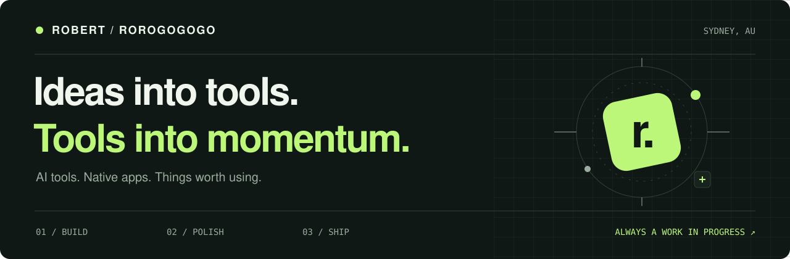
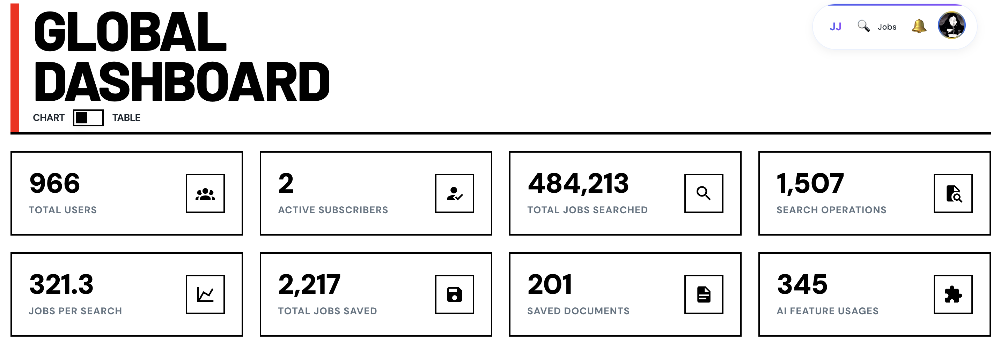
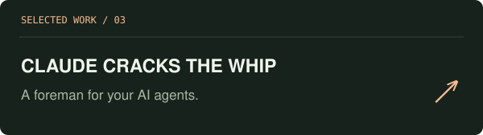
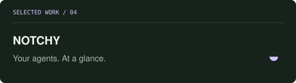
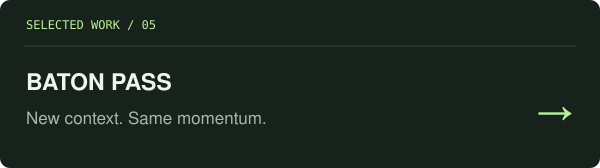
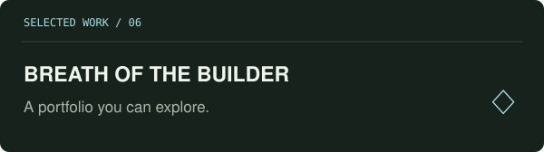

<picture>
  <source media="(prefers-color-scheme: dark)" srcset="./assets/header-dark.svg" />
  <source media="(prefers-color-scheme: light)" srcset="./assets/header-light.svg" />
  
</picture>

  <a href="https://robert.jobjourney.me/"><strong>Portfolio ↗</strong></a>
  &nbsp;&nbsp; / &nbsp;&nbsp;
  <a href="https://nomoreide.com">NoMoreIDE</a>
  &nbsp;&nbsp; / &nbsp;&nbsp;
  <a href="https://jobjourney.me">JobJourney</a>
  &nbsp;&nbsp; / &nbsp;&nbsp;
  <a href="https://github.com/Rorogogogo?tab=repositories">All projects</a>

### Hey, I’m Robert.

I build tools for the way I want to work: fewer repetitive steps, better interfaces, and AI agents that are easier to work with. My projects range from developer workbenches and job-search tools to tiny native apps—and occasionally an entire island.

**Current focus:** NoMoreIDE, agent workflows, and the details that make software feel good to use.

 

## The bigger builds

<table>
<tr>
<td width="50%" valign="top">

<h3><a href="https://github.com/Rorogogogo/nomoreide">01 / NoMoreIDE</a></h3>

<strong>Your coding agents need a workbench.</strong>

One shared surface for services, logs, Git, databases, and coding agents. Native desktop, web dashboard, terminal UI, CLI, and MCP.

<code>Rust</code> <code>TypeScript</code> <code>React</code> <code>Tauri</code>

<a href="https://nomoreide.com"><strong>Explore the product ↗</strong></a> · <a href="https://github.com/Rorogogogo/nomoreide">Source</a>

</td>
<td width="50%" valign="top">

<h3><a href="https://github.com/Rorogogogo/Jobjourney-extention">02 / JobJourney Assistant</a></h3>

<strong>A little more order in the job hunt.</strong>

A browser companion for collecting job listings and keeping your search organized. Save opportunities to JobJourney without losing your place.

<code>TypeScript</code> <code>React</code> <code>Browser extension</code>

<a href="https://jobjourney.me"><strong>Visit JobJourney ↗</strong></a> · <a href="https://github.com/Rorogogogo/Jobjourney-extention">Source</a>

</td>
</tr>
</table>

## Small tools. Specific problems.

<table>
<tr>
<td width="50%" valign="top">

Let Claude Code delegate tasks to other coding agents, review their work, and send back corrections.

<code>Agent orchestration</code> <code>Claude Code skill</code>

<a href="https://github.com/Rorogogogo/claude-cracks-the-whip"><strong>Meet the foreman ↗</strong></a>

</td>
<td width="50%" valign="top">

A tiny native macOS notch indicator for agent activity and usage. Know when your agent needs you.

<code>Swift</code> <code>macOS</code> <code>Native UI</code>

<a href="https://github.com/Rorogogogo/Notchy"><strong>Take a look ↗</strong></a>

</td>
</tr>
<tr>
<td width="50%" valign="top">

Hand a long-running agent session to a fresh one before context or usage limits interrupt the work.

<code>Go</code> <code>Agent continuity</code>

<a href="https://github.com/Rorogogogo/baton-pass"><strong>Pass the baton ↗</strong></a>

</td>
<td width="50%" valign="top">

A Zelda-inspired 3D portfolio island. Walk around, find project shrines, and take the scenic route through my work.

<code>TypeScript</code> <code>Three.js</code> <code>Creative coding</code>

<a href="https://breath-of-the-builder.vercel.app"><strong>Explore the island ↗</strong></a> · <a href="https://github.com/Rorogogogo/breath-of-the-builder">Source</a>

</td>
</tr>
</table>

<strong>More from the workshop</strong>

- **[roro-ui-lib](https://github.com/Rorogogogo/roro-ui-lib)** — React and TypeScript components you can copy, customize, and own.
- **[Workplace English Wingman](https://github.com/Rorogogogo/workplace-english-wingman)** — A skill for clearer, more natural Australian workplace English.
- **[JobJourney Claude Plugin](https://github.com/Rorogogogo/jobjourney-claude-plugin)** — MCP tools for saving jobs, tracking applications, and finding coffee-chat contacts.
- **[Brainctl](https://github.com/Rorogogogo/brainctl)** — My earlier cross-agent configuration tool. Its features now live in NoMoreIDE.

 

### What I keep coming back to

**Useful AI tools** · **Thoughtful interfaces** · **Native experiences** · **Open source**

I like software that solves a real annoyance, stays out of your way, and feels a little more considered than it needs to.

---

  Built in Sydney. Usually because I wanted the tool to exist. 
  <a href="https://robert.jobjourney.me/">See more of my work ↗</a>

